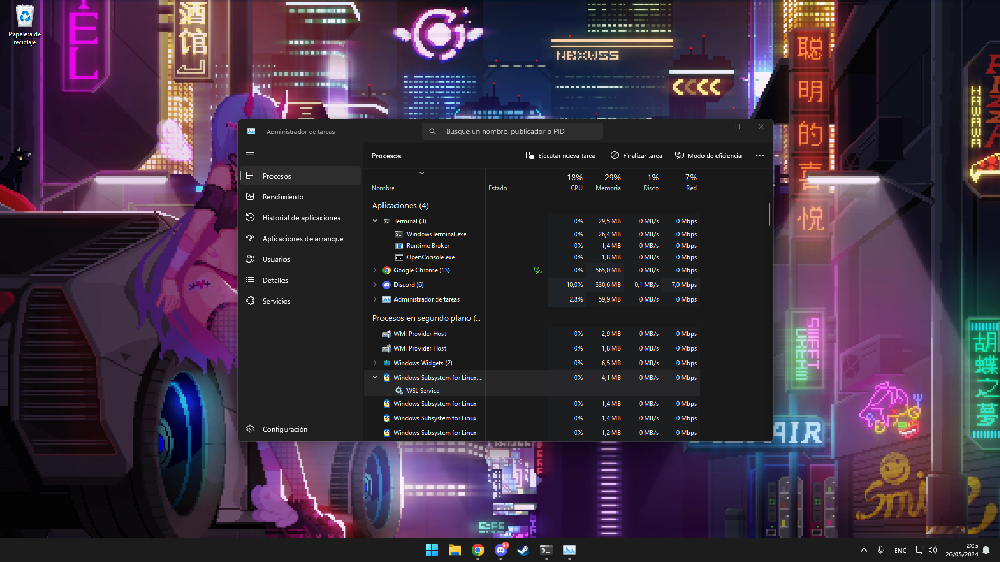

# Trabajo de Windows SuBsystem Linux

## a)Introducción

  - [¿Qué es WSL?](ficheros/wsl.md)

## b)Instalación

  - [Como instalar](ficheros/instalacion.md)

## d)Procesos asociados WSL

  - Los Procesos asociados de WSL son los que aparecen en la captura, vemos como esta el terminal ejecutado
    y en los procesos de segundo plano los cuatro procesos de WindowsSubystemLinix

  

## e) Referencias

- [microsoft](https://learn.microsoft.com/es-es/windows/wsl/install)

## Autores

  - [Andres del Pino Muñoz](https://github.com/0Vinylo0)

## Licencia

Este trabajo tiene la licencia <a href="https://creativecommons.org/licenses/by-nc/4.0/?ref=chooser- v1" target="_blank" rel="licencia noopener noreferrer" style="display:inline-block;">CC BY-NC 4.0</a>

