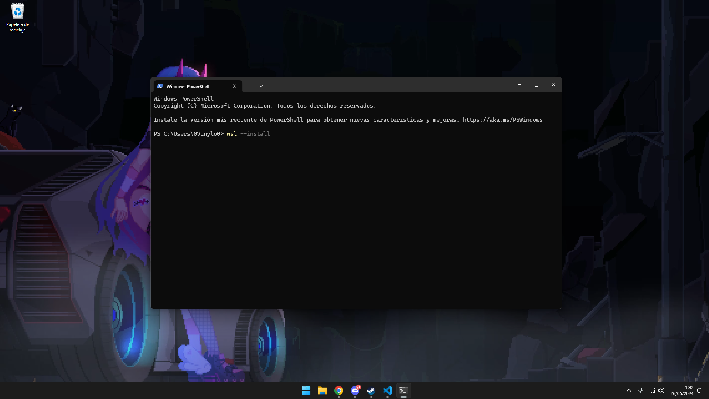
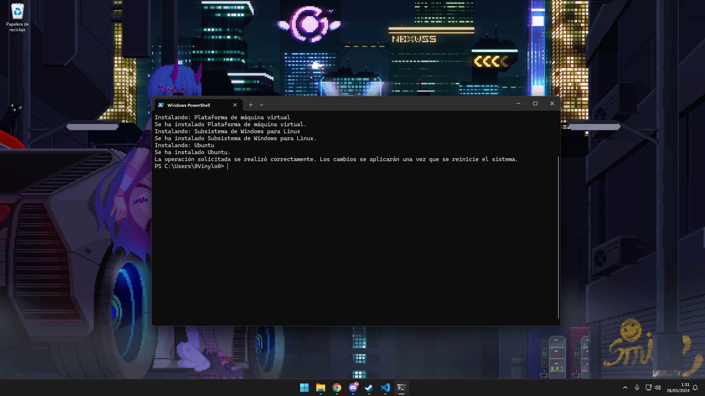
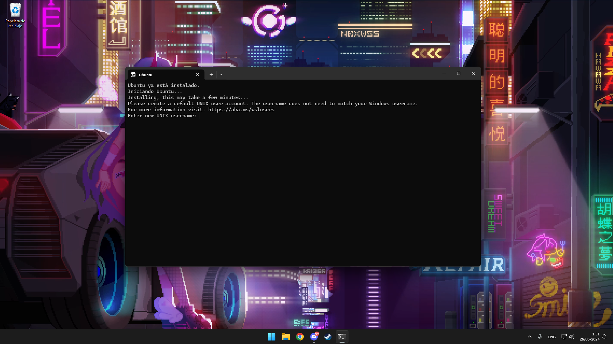
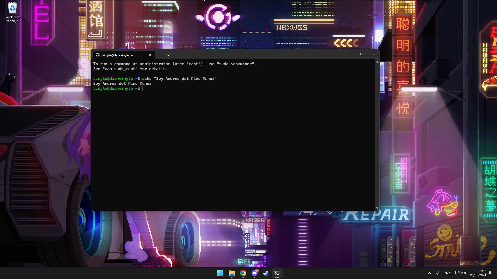

# Instalacion
- Para instalar abrimos una terminal de powershel con (win+r) y escribimos "powershell"

  

- Luego escribimos "wsl --install" y ejecutamos, esto instalara ubuntu pero si quieres otra distro pones "wsl --list --online" para ver las distros disponibles
  y la instalas con "-install -d <DistroName>"

  

- Y solo quedaria reiniciar el equipo y luego ejecuta

  

- Luego de reiniciar te saldra automatiocamnete una terminal con el sistema instalado en este caso ubuntu y te pedira que crees un usuario con su contraseñe

  

- Y ya estaria listo para usar nuesto ubuntu dentro de windows

  
